# Prim's Algorithm

1. 처음에 사용할 공간을 랜덤으로 한군데를 정한다.
 - 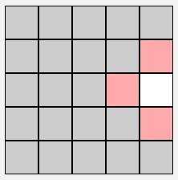
2. 처음에 정한 곳과 인접한 칸을 정해 길을 연결한다
- 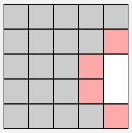
3. 현재 확장된 미로와 인접한 칸을 확장하는 과정을 무한 반복한다.
- 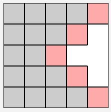 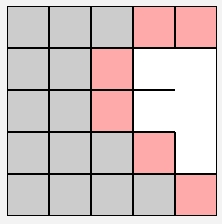

# Hunt-and-Kill Algorithm
1. 처음의 랜덤하게 시작 점을 한군데 정한다.
- 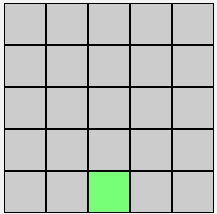
2. 시작점에서 계속해서 이동하면서 확장한다.
- 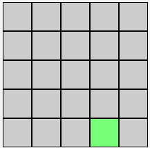
3. 막혔을 경우에는 미로와 접촉되어 있는 부분을 찾아서 그 부분을 통해 다시 확장을 시작하고 다시 막혔을 경우에는 다른 부분을 찾아서 확장을 시작한다.
- 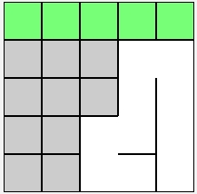
- 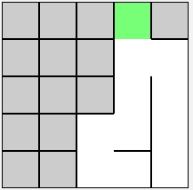
4. Profit!
- 

# Wilson's Algorithm
1. 미로의 시작점을 한 군데 정한다.
- 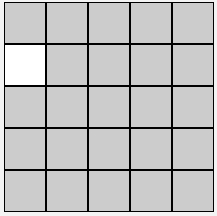
2. 이 외의 칸 중에서 한 곳을 랜덤으로 정한다.
- 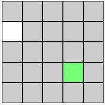
3. 미로와 닿을 때까지 랜덤으로 움직인다.
- 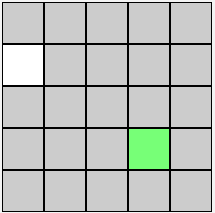
4. 미로와 닿았을 때의 이동기록을 통해서 확장을 한다.
- 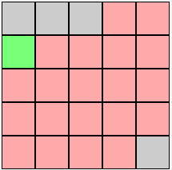
- 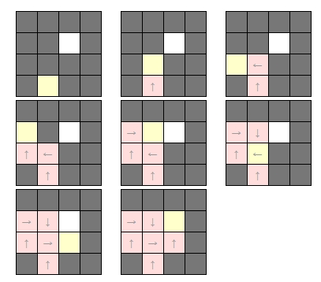
5. 미로가 완성될 때까지 반복
- 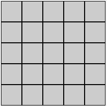