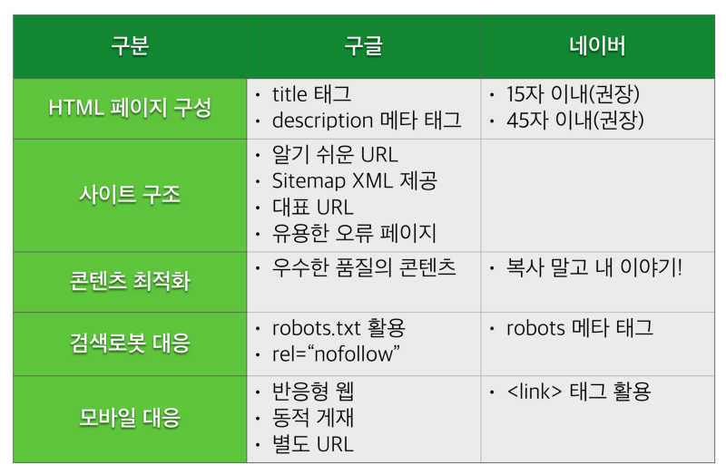
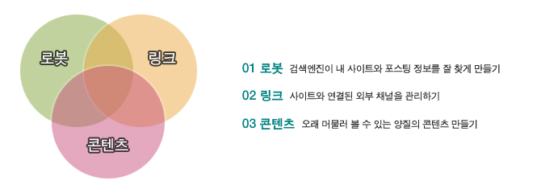
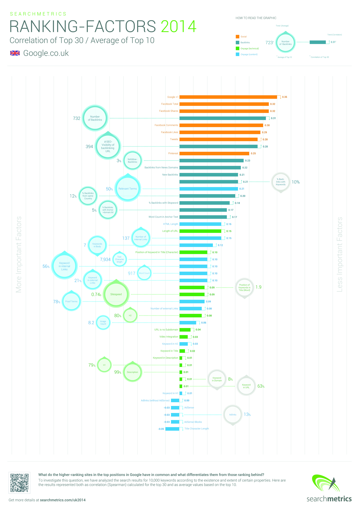
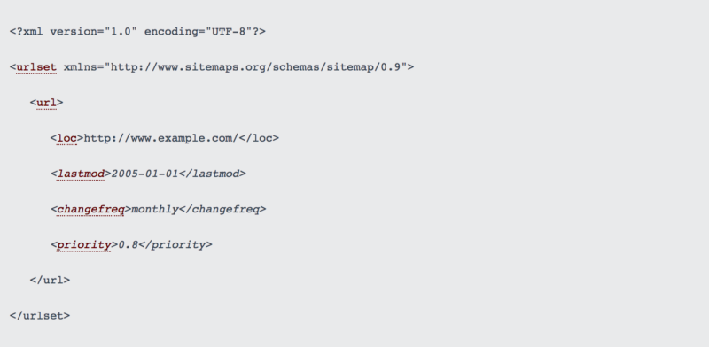
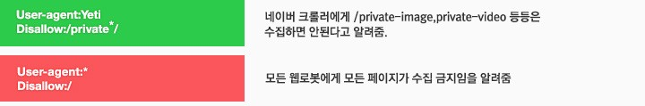
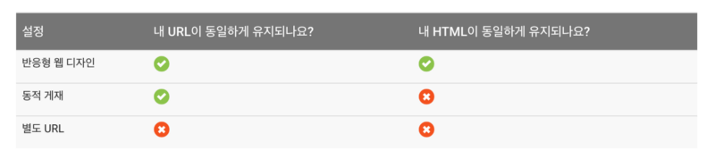

# 검색 엔진
* 웹에 존재하는 정보와 웹 사이트를 검색하기 위한 프로그램

# 검색 엔진 최적화



* SEO는 한 마디로 내 웹사이트를 구글이나 네이버와 같은 검색엔진의 검색결과 상단에 노출시킬 수 있도록 최적화하는 방법입니다.
* https://support.google.com/webmasters/answer/139066?hl=ko
* https://support.google.com/webmasters/topic/6001981?hl=ko&ref_topic=3309300
* 검색엔진과 함께 제공되는 웹마스터 도구(구글, 네이버)는 검색엔진을 제어하고 검색과 색인 상태를 확인하는데 있어 없어서는 안될 중요한 도구이니 늘 곁에 두고 활용하는 것이 좋습니다
* 검색엔진 최적화는 개별 페이지 단위로 이루어집니다.
* 자신의 사이트의 페이지가 검색 엔진에서 색엔에 등록되었는지 여부는 검색창의 `site:<url>` 형식으로 검색해보면 확인 가능
* https://static.googleusercontent.com/media/www.google.co.kr/ko/kr/intl/ko/webmasters/docs/search-engine-optimization-starter-guide-ko.pdf

## 명확하고 독장적인 타이틀 사용
* 독창적인 

## title 태그와 description meta 태그
* title 태그는 해당 페이지의 제목
* description meta 태그은 그 페이지에 대한 설명을 포함시키면 됩니다.
* 네이버의 경우 제목은 15자 설명은 45자 이내를 권장

## 제목 태그의 적절한 사용

## 오픈그래프

## 알기 쉬운 url 사용
* 이상한 이름의 매개변수보다는 페이지 url에는 가급적 페이지와 연관되는 단어를 넣을 것

## sitemap.xml

* 사이트맵은 웹사이트의 구조를 알려주는 형식의 파일
* https://www.sitemaps.org/

[https://cdn-images-1.medium.com/max/1600/1*-KiS8ETwBRzWWeun2U7RVw.png]

## 대표 url
* 하나의 페이지에 대해 여러 URL이 존재할 경우 대표 URL을 사용하는 것이 좋음.
* 나머지 URL에 대해서는 대표 URL로 301 리다이렉션 시키거나
```
<link rel="canonical" href="https://blog.example.com/dresses/green-dresses-are-awesome" />
```
* rel="canonical" 표시로 선호 url 추가 권장

## 유용한 오류 페이지 반환
* 없는 url 접속시 404 페이지를 반환하고, 사이트에 맞는 맞춤형 오류 페이지를 보여주는 것이 좋다. 404페이지의 경우 http 규약에 따라 404 코드 반환

## 앵거 태그
* 페이지 이동에 사용되는 <a> 태그의 텍스트는 이동할 페이지의 내용을 함축하는 간결한 텍스트 위주 사용

## 콘텐츠 최적화
* 경쟁력 있는 좋은 콘텐츠를 만드는 것도 seo의 좋은 방법 중 하나
* 네이버에서도 강조
	* http://webmastertool.naver.com/guide/basic_optimize.naver#chapter3.2

## robots.txt

* http://www.robotstxt.org/
* 로봇은 검색엔진에서 사이트를 수집하고 분석하는 프로그램
* 검색엔진이 사이트에서 액세스할 수 있는 부분과 안되는 부분을 정해 놓은 검색엔진과의 규약을 담은 파일
* 반드시 root에 위치해야 한다.

### rel=“nofollow
* 앵커 태그에서 검색엔진이 따라가기를 원치 않는 경우에는
```
<a href="https://blog.example.com/spam-page" rel="nofollow">스팸 페이지</a>
```
```
<meta name="robots" content="noindex">
```
* 이 때 content 값에 noindex를 사용하면 해당 페이지는 검색 결과에서 제외되며, nofollow를 사용하면 검색로봇이 해당 페이지 내의 링크를 따라가지 않도록 설정할 수 있습니다. 기본 설정은 index, follow 입니다.

## 모바일
* g.co/mobilefriendly
* 구글은 웹 검색을 위한 User Agent 값으로는 “Googlebot”을, 그리고 모바일 버전을 위해서는 “Googlebot-Mobile”을 사용하며, 웹과 모바일 검색에 있어 다른 색인(index)을 관리합니다.
* 참고로, 구글은 사이트가 모바일에 친화적인지 검사할 수 있는 모바일 친화성 테스트 도구를 제공합니다. 이 도구를 통해 내 사이트가 모바일 환경에 최적화되어 있는지 확인할 수 있습니다.

* 모바일 구현에는, 반응형 웹 디자인, 동적 게재, 별도 URL 세가지가 있다.

## 네이버 만의 방법
1. (필수) 네이버 웹마스터 도구를 통하여 웹사이트를 등록합니다. ([웹마스터 도구](http://webmastertool.naver.com/))
2. (필수) 검색엔진 최적화 기본 가이드에 따라 최소한의 최적화를 시행합니다. ([검색엔진 최적화 기본 가이드](http://webmastertool.naver.com/guide/basic_optimize.naver))
3. (필수) 이미 기본 가이드에도 나와있지만 만약 기존에 보유하고 있는 사이트맵(sitemap.xml)이 있다면 이를 반드시 네이버에 제출합니다. (이미 있는데 제출하지 않을 이유가 없으므로)
4. (옵션) 더 많은 웹사이트들 색인하고자 한다면 신디케이션 핑(Ping)을 네이버 서버에 전송합니다. ([신디케이션 기술문서](http://webmastertool.naver.com/guide/syndi_guide.naver))
5. (옵션) 보유한 콘텐츠 중 일부를 그래도 검색결과에 노출될 가능성이 높은 블로그에 자동으로 기재하고자 한다면 네이버의 블로그 API를 사용합니다. ([블로그 API 기술문서](https://developers.naver.com/main/)) 하지만 네이버 블로그 API를 사용해도 실제적으로 확보할 수 있는 조회수는 극히 적을 수 있습니다.

## Searchmetrics의 2014년 버전의 영국기준 랭킹 Metrics
1. 클릭률: 검색 결과에서 사이트 노출 대비 클릭 비
1. 연관 키워드: 특정 주제와 연관된 키워드 사이트 내 존재하고 있는지 여부
1. Google+1: 소셜 미디어인 구글플러스에서 +1이 눌러진 횟수
1. 백링크 개수: 다른 사이트에서 우리 사이트를 가르키는 링크가 얼마나 많은지
1. 페이스북 공유 갯수
1. 페이스북 트래픽: 펭스북에서 해당 사이트로 타고 들어오는 트래픽
1. 백링크 가시성: 백링크로 우리 사이트를 참조하고 있는 다른 사이트의 SEO 랭킹 혹은 신뢰도
1. Nofollow 백링크